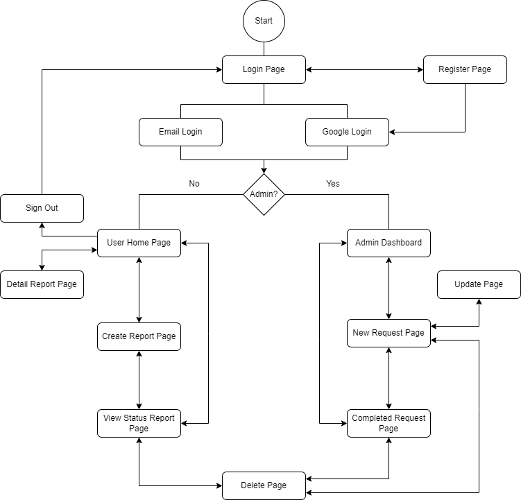

# IIUM RoadCare

## Members
- Afnan Iman bin Azman (1920311)
- Ahmad Azim bin Abdul Aziz (2014781)
- Muhammad Haikal Wijdan bin Rizal (1916771)

## Introduction
Having problems with potholes around the campus? With the IIUM RoadCare app, you can report potholes around the campus with a picture and accurate location to smoothen the fixing progress.

## Objective
To create a mobile application where students and staff can report road potholes in the IIUM Campus. Users can input location, severity, and additional details about the pothole. It also has a feature to track the status of reported potholes to provide transparency on when they are scheduled for repair or have been fixed.

## Features and Functionalities
- Student and Staff Registration & Login
- Camera and Location Package for Reporting
- Pothole Reporting (Student & Staff)
- Pothole Review (Admin)
- Pothole Status Update (Admin)

## Sequence Diagrams
### User Sequence Diagram
 

### Admin Sequence Diagram

### Screen Implementation Diagram

## References
1. Flutter Auth Login: https://youtu.be/4fucdtPwTWI?si=-d6Hk1DsNiyAYas7
2. Upload Images to Firebase Storage: https://youtu.be/-NQWNy-5i2E?si=GtWpIXwJR3oobYkv / https://www.geeksforgeeks.org/flutter-upload-images-on-firestore-storage/
3. Image Picker Package: https://www.youtube.com/watch?v=UEJK3mEBvOg&t=2s
4. Google Map Setup & Display: https://www.youtube.com/watch?v=M7cOmiSly3Q
5. Google Map Set Location: https://www.youtube.com/watch?v=s6v8fjtL-Mc
6. URL Launcher: https://pub.dev/packages/url_launcher
7. Geocoder: https://pub.dev/packages/geocoder2
