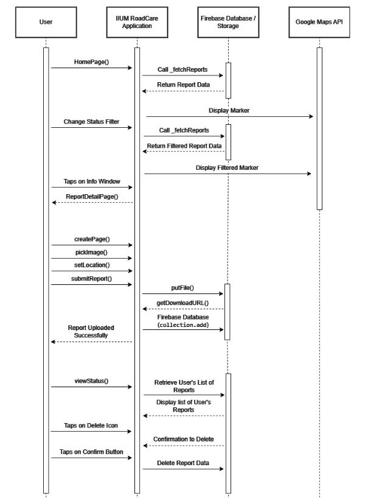

# IIUM_RoadCare
IIUM Road Care

Members: 
1. Afnan Iman bin Azman (1920311)
2. Ahmad Azim bin Abdul Aziz (2014781)
3. Muhammad Haikal Wijdan bin Rizal (1916771)

Introduction: 
Having problems with potholes around the campus? With IIUM RoadCare app you can report potholes around the campus with picture and accurate location to smoothen the fixing progress.

Objective:
To create an mobile application where students and staff can report road potholes in IIUM Campus. Users can input location, severity and additional details about the pothole. It also has a feature to track status of reported potholes to provide transparency on when they are scheduled for repair or have been fixed. 

Feature and functionalities: 
- Student and Staff Registration & Login
- Camera and Location Package for Reporting
- Pothole Reporting (Student & Staff)
- Pothole Review (Admin)
- Pothole Status Update (Admin)

