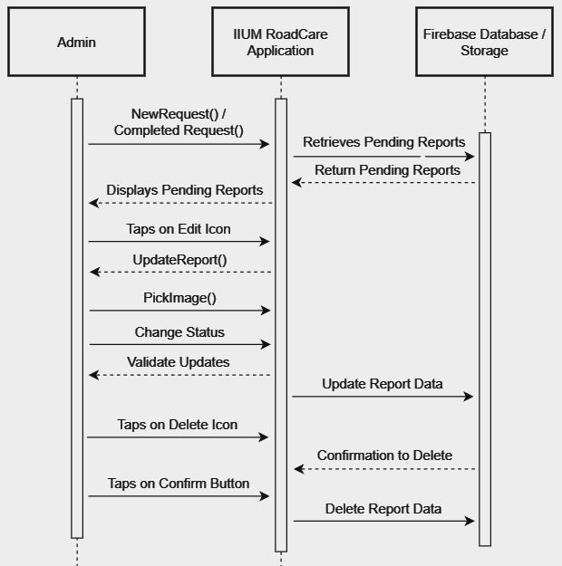

# IIUM RoadCare

## Members
- Afnan Iman bin Azman (1920311)
- Ahmad Azim bin Abdul Aziz (2014781)
- Muhammad Haikal Wijdan bin Rizal (1916771)

## Introduction
Having problems with potholes around the campus? With the IIUM RoadCare app, you can report potholes around the campus with a picture and accurate location to smoothen the fixing progress.

## Objective
To create a mobile application where students and staff can report road potholes in the IIUM Campus. Users can input location, severity, and additional details about the pothole. It also has a feature to track the status of reported potholes to provide transparency on when they are scheduled for repair or have been fixed.

## Features and Functionalities
- Student and Staff Registration & Login
- Camera and Location Package for Reporting
- Pothole Reporting (Student & Staff)
- Pothole Review (Admin)
- Pothole Status Update (Admin)

## Sequence Diagram
 

